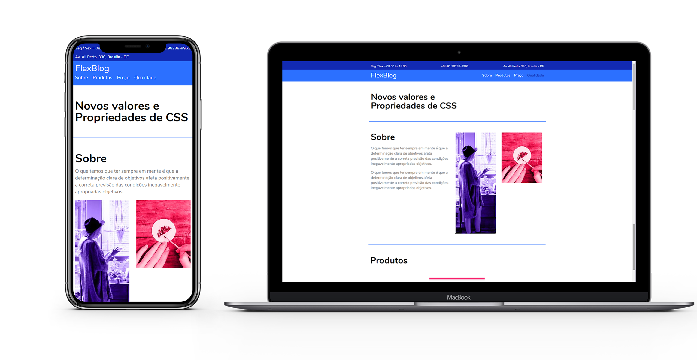

<h3 align="center">
  🚀 Flex Blog
</h3>

  

  
  
  

 

  
  <a href="https://blog-flex.netlify.app/">Ver Site<a>

## 💻 Projeto

O Projeto foi criado apartir das aulas de flexbox da Origamid. Consiste no treino da propriedade Flexbox.

---

Feito com ♥ by ME :wave:
